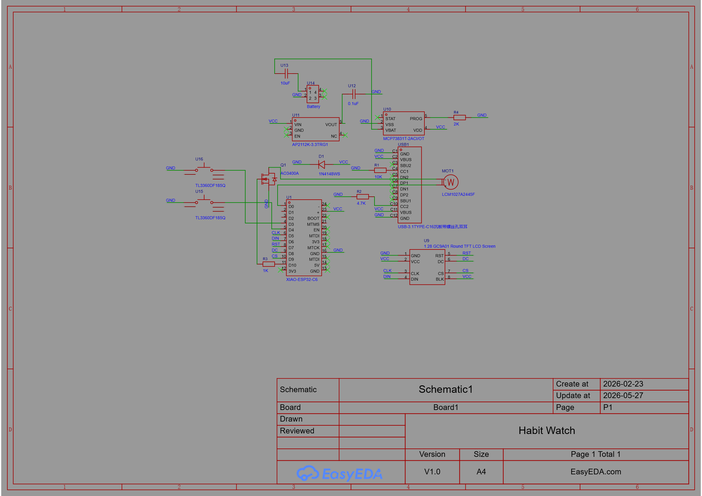
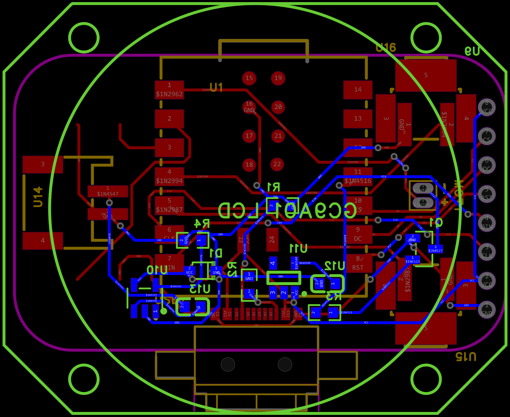

# Habitwatch

This is the Habitwatch, a custom designed smartwatch for keep track of habits. It uses an Xiao ESP-32-C6 4.0 development board, compact enough to fit in a small sized enclosure, while having many features. The main function is a highly customizable reminder/alarm system, that works along side a integrated vibration motor to remind you to keep all habits you want. The firmware also allows users to customize the motor to produce a custom monophonic ringtone. Extra features include connectivity with devices via wifi, bluetooth, etc... All electronics are smarly housed in a custom-designed 3D-printed compact enclosure (with a reasonable size for a watch).

I made this project because I know first-hand the difficulty of upholding good habits, and wanted to make a project to help out with a common life problem. I also wanted this watch to be truely useful to everyday life.

## Images

### Schematic

*Complete wiring diagram showing all connections*

### PCB Design

*Custom PCB design for the Habitwatch circuit*

### 3D Enclosure - Front

*Custom-designed 3D-printed enclosure front view*

### 3D Enclosure - Back

*Custom-designed 3D-printed enclosure back view*

